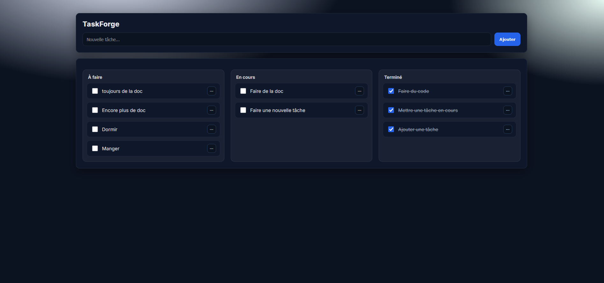

# 📈 Progression — TaskForge (S1 → S11)

> Suivi hebdomadaire du projet **TaskForge**, développé dans le cadre du Bachelor IABD.  
> Chaque semaine correspond à un jalon technique de montée en compétences, avec un objectif précis, des tests attendus et la documentation à produire ou à mettre à jour.

---

## 🧩 Semaine 1–2 — JavaScript / TypeScript (CRUD LocalStorage)
> 🎯 Objectif : MVP fonctionnel en JS/TS pur, avec persistance locale via `localStorage`.

### Dev
- [x] Créer la structure du projet (`src/`, `public/`)
- [x] Créer une maquette HTML simple (form + liste)
- [x] Implémenter `storage.js` (LocalStorage)
- [x] Implémenter `ui.js` (rendu DOM, interactions)
- [x] Implémenter `main.js` (logique CRUD + refresh)
- [x] Vérifier la persistance après refresh
- [x] Ajouter script `npm run dev` (http-server)

### Tests
- [x] Parcours manuel complet : add → toggle → delete → refresh
- [x] Vérifier absence d’erreurs console

### Docs
- ✅ `docs/architecture/ARCHITECTURE_S1-S2.md`
- ✅ `docs/modules/storage.md`
- ✅ `docs/INSTALL_DEV.md`
- ✅ `docs/conventions.md`
- ✅ `docs/glossary.md`
- ✅ `docs/ui.md`
- ✅ `docs/main.md`
- ✅ `CHANGELOG.md` → section `v0.1.0` 

### 🖼️ Aperçu final

---

## 🚀 Semaine 3 — API REST (Node / Express)
> 🎯 Objectif atteint : mise en place d’un backend Express minimaliste exposant les routes CRUD `/api/tasks`.

### Dev
- [x] Initialisation du backend Express (`app.js`)
- [x] Ajout des middlewares globaux : `cors`, `morgan`, `express.json()`
- [x] Création du routeur `/api/tasks` (`tasks.routes.js`) avec CRUD complet :
  - `GET /api/tasks` — liste toutes les tâches
  - `POST /api/tasks` — ajoute une tâche
  - `PUT /api/tasks/:id` — modifie une tâche
  - `DELETE /api/tasks/:id` — supprime une tâche
- [x] Gestion des erreurs centralisée (`error.js`)
- [x] Endpoint de santé `GET /api/health`

### Tests
- [x] Tests manuels via **Postman** (CRUD complet validé)
- [x] Vérification des statuts HTTP, payloads et gestion des erreurs

### Docs
- ✅ `docs/backend/app.md` — initialisation Express
- ✅ `docs/backend/error.md` — gestion des erreurs
- ✅ `docs/backend/tasks.routes.md` — endpoints CRUD
- ✅ `docs/backend/architecture_S3.md` — schéma d’API et flux de données
- ✅ `README.md` — ajout mention “API Express”
- ✅ `CHANGELOG.md` — ajout version `v0.2.0`

---

## ⚛️ Semaine 4 — React (bases)
> 🎯 **Objectif atteint** : mise en place du front React avec Vite + TypeScript, composants fonctionnels de base et premier state local.

### Dev
- [x] Initialisation du projet React (Vite + TypeScript)
- [x] Création des composants : `TaskForm`, `TaskList`, `TaskItem`
- [x] Mise en place du style global (`src/styles/global.css`)
- [x] Gestion du state local avec `useState` et `useEffect`
- [x] Définition des types (`types.ts`)
- [x] Structure claire du dossier `src/components/`
- [x] Préparation du Context API pour la suite (structure et typage)
- [x] Lancement front via `npm run dev`

### Tests
- [x] Test manuel d’affichage : ajout / suppression / cochage de tâche
- [x] Vérification du rendu sans erreur console
- [x] Validation du flux de données entre les composants (props descendantes)

### Docs
- ✅ `docs/architecture/ARCHITECTURE_S4.md` — schéma structure front React
- ✅ `README.md` — ajout section “Phase React (Vite + TypeScript)”

---

## ⚛️ Semaine 5 — React (avancé + intégration API)
> 🎯 **Objectif atteint** : intégration complète du front React avec le backend Express, gestion du state global via Context API, routing, effets, et persistance.

### Dev
- [x] Mise en place du `TasksContext` (state global, CRUD complet)
- [x] Création du module API `lib/api.ts` (GET / POST / PATCH / DELETE)
- [x] Synchronisation complète React ↔ API Express
- [x] Création du `utils/store.js` côté back (persistance asynchrone)
- [x] Correction format JSON (`{ data: … }`) et typage `ID = string | number`
- [x] Intégration `react-router-dom` : vues `/`, `/todo`, `/done`
- [x] Ajout du composant `TasksCounter` (compteur dynamique)
- [x] Optimisation (memoization légère, gestion d’erreurs)
- [x] Prévention redémarrages Nodemon (`nodemon.json`)

### Tests
- [x] Tests manuels complets depuis l’UI : add → toggle → delete → reload
- [x] Validation navigation (React Router)
- [x] Vérification persistance des données dans `tasks.json`
- [x] Test API via Postman : statuts 200/201/204, cohérence JSON

### Docs
- ✅ `docs/architecture/ARCHITECTURE_S5.md` — schéma React + API
- ✅ `CHANGELOG.md` — entrée `v0.3.0` → “Intégration React / API”
- ✅ `PROGRESSION.md` — jalons S4 et S5 validés

---

## 🌐 Semaine 6 — Next.js (bases)
> 🎯 Objectif : migration progressive du front React vers Next.js, avec SSR et structure app.

### Dev
- [x] Initialiser projet Next.js
- [x] Pages statiques et dynamiques (app/)
- [x] Découverte SSR / SSG
- [x] Migration partielle depuis React (réutiliser composants)

### Tests
- [x] Vérifier SSR / SSG (rendu côté serveur)

### Docs
- ✅ `docs/architecture/ARCHITECTURE_S6.md`
- ✅ `docs/INSTALL.md` → section “Next.js”
- ✅ `CHANGELOG.md` — entrée `v0.4.0`

---

## 🌐 Semaine 7 — Next.js (avancé)
> 🎯 Objectif : gestion d’authentification et d’API routes dans Next.js.

### Dev
- [x] Créer les API Routes `/api/tasks` dans Next (GET, POST, PUT, DELETE)
- [x] Ajouter une route d’auth simple (ex: `/api/auth/login`) avec un user de test
- [x] Mettre en place un token d’auth simple stocké côté client (LocalStorage)
- [x] Créer un `AuthContext` pour partager l’état de connexion dans le front
- [x] Protéger la page privée `/tasks` via un guard côté client (redirection vers `/login`)
- [x] Brancher le front Next (page `/tasks`) sur les API Routes (`/api/tasks`)

### Tests
- [x] Tester manuellement le flow complet : login → accès aux tâches → refresh → toujours connecté
- [x] Vérifier qu’un utilisateur non connecté est bien redirigé vers `/login`
- [x] Tester les endpoints `/api/tasks` et `/api/auth/login` via Postman

### Docs
- ✅ Créer `docs/architecture/ARCHITECTURE_S7.md` (schéma Auth + API Routes)
- ✅ Mettre à jour `docs/INSTALL.md` avec la partie “Next.js Auth”
- ✅ Mettre à jour `CHANGELOG.md` avec la version `0.4.x` (Next avancé / Auth)
- ✅ Mettre à jour le `README.md` pour mentionner l’auth Next.js

---

## 🎨 Semaine 8 — UI / UX Avancée
> 🎯 Objectif : améliorer l’expérience utilisateur (DnD, filtres, thèmes, accessibilité).

### Dev
- [x] Drag & Drop (dnd-kit) sur le board 3 colonnes
- [x] Filtres / recherche (local) sur les tâches
- [x] Thème clair/sombre avec toggle et persistance (`localStorage`)
- [x] Accessibilité de base (focus & ARIA pour menu utilisateur et panneau de filtres)

### Tests
- [x] Tests manuels DnD + filtres, light/dark mode

### Docs
- ✅ `docs/architecture/ARCHITECTURE_S8.md`

---

## 🐳 Semaine 9 — Docker
> 🎯 Objectif : conteneurisation du front et du back pour un environnement de dev isolé.

### Dev
- [ ] `Dockerfile` backend + `.dockerignore`
- [ ] `docker-compose.yml` (API + front)
- [ ] Variables d’environnement (`.env`)

### Tests
- [ ] Build & run local
- [ ] Vérifier endpoints dans conteneurs

### Docs
- 📄 `docs/infra/docker.md` → créer
- 📄 `README.md` → section Docker
- 📄 `CHANGELOG.md` → `v0.6.0`

---

## 🗃️ Semaine 10 — PostgreSQL + Compose
> 🎯 Objectif : mise en place d’une base de données persistante via Docker Compose.

### Dev
- [ ] Intégrer PostgreSQL (Prisma ou Sequelize)
- [ ] Configurer `docker-compose.yml` (API + DB + volumes)
- [ ] Table `tasks` + migrations
- [ ] Adapter routes API

### Tests
- [ ] Tests d’intégration API ↔ DB
- [ ] Vérifier migrations / rollback

### Docs
- 📄 `docs/architecture/ARCHITECTURE_S10.md`
- 📄 `docs/infra/docker.md` → update
- 📄 `CHANGELOG.md` → `v0.7.0`

---

## ☸️ Semaine 11 — Kubernetes
> 🎯 Objectif : déploiement local avec Minikube (pods, services, ingress).

### Dev
- [ ] Manifests `deployment.yaml`, `service.yaml` (front + API)
- [ ] Déploiement local Minikube
- [ ] Vérifier communication entre services

### Tests
- [ ] Vérifier pods/services (`kubectl get all`)
- [ ] Test navigation via NodePort / Ingress

### Docs
- 📄 `docs/infra/k8s.md` → créer
- 📄 `CHANGELOG.md` → `v1.0.0`
- 📄 `README.md` → version finale / déploiement
